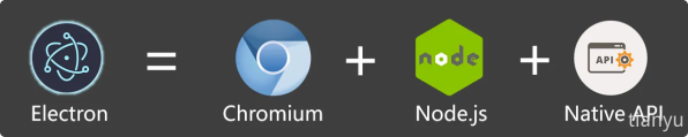
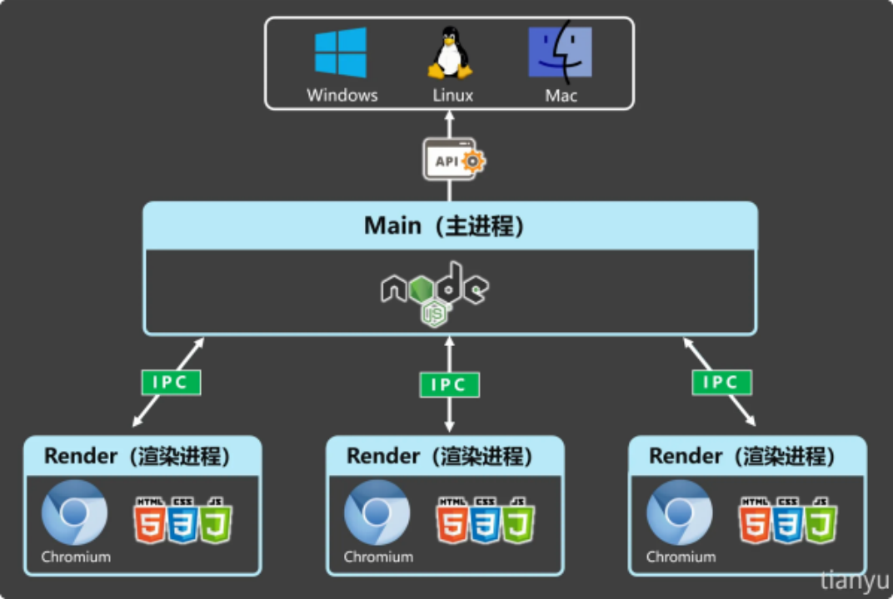
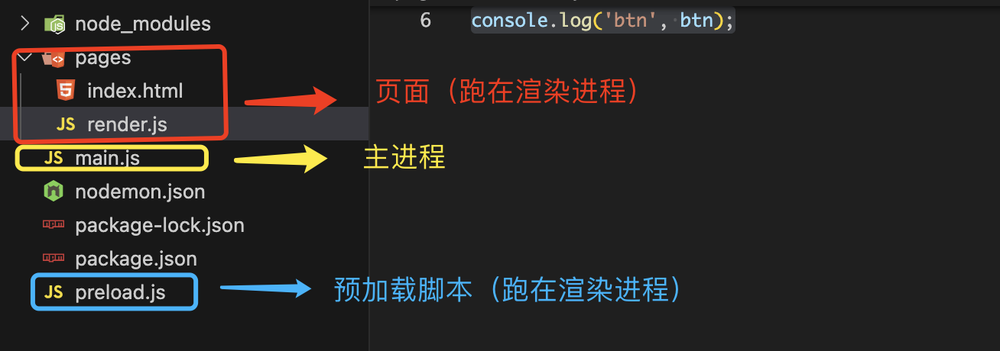

# Electron-01  electron概念、搭建⼀个⼯程

## Electron概念

Electron 是⼀个跨平台桌⾯应⽤开发框架，开发者可以使⽤：HTML、CSS、JavaScript 等
Web 技术来构建桌⾯应⽤程序，它的本质是结合了 Chromium 和 Node.js，现在⼴泛⽤于桌⾯应
⽤程序开发。

### 优势

1. 可跨平台：同⼀套代码可以构建出能在：Windows、macOS、Linux 上运⾏的应⽤程序。
2. 上⼿容易：使⽤ Web 技术就可以轻松完成开发桌⾯应⽤程序。
3. 底层权限：允许应⽤程序访问⽂件系统、操作系统等底层功能，从⽽实现复杂的系统交互。
4. 社区⽀持：拥有⼀个庞⼤且活跃的社区，开发者可以轻松找到⽂档、教程和开源库。

### 架构组成



Electron可以分为Chromium、Node.js、Native apis三大核心模块
Chromium： 支持最新特性的浏览器
Node.js： javascript运行时，可实现文件读写等
Native apis： 提供统一的原生界面能力，与操作系统通讯、获取设备硬件的信息、快捷键等

### 进程模型



### 代码架构

**主进程**(main.js): 在 Node.js 环境中运行，这意味着它具有 require 模块和使用所有 Node.js API 的能力。

**媒介脚本**(preload.js):运行在渲染进程中，但这里能访问部分的node API,通过它向渲染进程中注册变量和方法，是进程通讯不可或缺的部分。

**渲染进程**(index.html):一个完全的浏览器环境

## 搭建⼀个⼯程

[详情请看官网快速入门](https://www.electronjs.org/zh/docs/latest/tutorial/quick-start)
* 初始化⼀个包，并提填写好 package.json 中的必要信息及启动命令。
```json 
{
  "name": "my-electron-app",
  "version": "1.0.0",
  "description": "Hello World!",
  "main": "main.js",
  "scripts": {
    "test": "echo \"Error: no test specified\" && exit 1",
    "start": "nodemon --exec electron ."
  },
  "keywords": [
    "electron"
  ],
  "author": "wing",
  "license": "MIT",
  "devDependencies": {
    "electron": "^34.0.0",
    "nodemon": "^3.1.9"
  }
}
```


* 在 main.js 中编写代码，创建⼀个基本窗⼝

```js
/*
main.js运⾏在应⽤的主进程上，⽆法访问Web相关API，主要负责：控制⽣命周期、显示界⾯、
控制渲染进程等其他操作。
*/
const {
  app,
  BrowserWindow
} = require('electron')
// 在你文件顶部导入 Node.js 的 path 模块
const path = require('node:path')

// ⽤于创建窗⼝
const createWindow = () => {
  const win = new BrowserWindow({
    width: 800, // 窗⼝宽度
    height: 600, // 窗⼝⾼度
    autoHideMenuBar: true, // ⾃动隐藏菜单栏
    alwaysOnTop: true, // 置顶
    x: 0, // 窗⼝位置x坐标
    y: 0, // 窗⼝位置y坐标
    webPreferences: {
      preload: path.join(__dirname, 'preload.js') // 主进程连接preload
    }
  })

  win.loadFile('./pages/index.html')
  // 打开 DevTools
  win.webContents.openDevTools()
}
// 当app准备好后，执⾏createWindow创建窗⼝
app.whenReady().then(() => {
  createWindow()
  // 当应⽤被激活时
  app.on('activate', () => {
    // 如果当前应⽤没有窗⼝，则创建⼀个新的窗⼝
    if (BrowserWindow.getAllWindows().length === 0) createWindow()
  })
})
// 当app准备好后，执⾏createWindow创建窗⼝
// app.on('ready', () => {
//   createWindow()
//   当应⽤被激活时
//   app.on('activate', () => {
//     如果当前应⽤没有窗⼝，则创建⼀个新的窗⼝
//     if (BrowserWindow.getAllWindows().length === 0) createWindow()
//   })
// })

// 当所有窗⼝都关闭时
app.on('window-all-closed', () => {
  // 如果所处平台不是mac(darwin)，则退出应⽤。
  if (process.platform !== 'darwin') app.quit()
})
```

`app.whenReady().then()`与`app.on('ready', ()=> {})`功能一样，whenReady是一个promise的形式，而后者是一回调函数的形式。你作为一个资深的程序猿一定懂的。

* 创建 pages/index.html 编写内容：

```html
<!DOCTYPE html>
<html>
 <head>
 <meta charset="UTF-8" />
 <meta http-equiv="Content-Security-Policy" content="default-src 'self'; style-src 'self' 'unsafe-inline'; img-src 'self' data:;">
 <title>index</title>
 </head>
 <body>
 <h1>你好啊！</h1>
  <button id="btn">在⽤户的D盘创建⼀个hello.txt</button>
  <script type="text/javascript" src="./render.js"></script>
 </body>
</html>
```

> [!WARNING]
>解决开发者⼯具会报出⼀个安全警告，需要配置 CSP(ContentSecurity-Policy)
`<meta http-equiv="Content-Security-Policy" content="default-src 'self'; style-src 'self' 'unsafe-inline'; img-src 'self' data:;">`

上述配置的说明
1、 **`default-src 'self'`**

* `default-src`: 配置加载策略，适⽤于所有未在其它指令中明确指定的资源类型。
* `self`: 仅允许从同源的资源加载，禁⽌从不受信任的外部来源加载，提⾼安全性。

2、 **`style-src 'self' 'unsafe-inline'`**

* `style-src`: 指定样式表（CSS）的加载策略。
* `self`: 仅允许从同源的资源加载，禁⽌从不受信任的外部来源加载，提⾼安全性。
* `unsafe-inline`: 允许在HTML⽂档内使⽤内联样式。

3、**`img-src 'self' data:`**

* `img-src`：指定图像资源的加载策略。
*`self`: 表示仅允许从同源加载图像。
*`data:`: 允许使⽤ data: URI 来嵌⼊图像。这种URI模式允许将图像数据直接嵌
⼊到HTML或CSS中，⽽不是通过外部链接引⽤。
关于 CSP 的详细说明请参考：[MDN-Content-Security-Policy](https://developer.mozilla.org/zh-CN/docs/Web/HTTP/Headers/Content-Security-Policy)

---


* 创建预加载脚本 preload.js ，内容如下：

> [!INFO]
> 需求：点击按钮后，在⻚⾯呈现当前的 Node 版本。通过preload向渲染进程中注入变量（myAPI）

``` js
const { contextBridge } = require('electron')
// 暴露数据给渲染进程
contextBridge.exposeInMainWorld('myAPI', {
  n: 666,
  version: process.version
})
```

* 创建预加载脚本 render.js ，内容如下：
在渲染进程中使⽤ version

``` js
btn.addEventListener('click', () => {
  console.log(myAPI.version)
  document.body.innerHTML += `<h2>${myAPI.version}</h2>`
})
```
整体⽂件结构如下：




### 配置⾃动重启

1、 安装 Nodemon

```shell
npm i nodemon -D 
```

2、 修改 package.json 命令

```json
"scripts": {
 "start": "nodemon --exec electron ."
},
```

3、 配置 `nodemon.json` 规则

```json
{
 "ignore": [
 "node_modules",
 "dist"
 ],
 "restartable": "r",
 "watch": ["*.*"],
 "ext": "html,js,css"
}
```

配置好以后，当代码修改后，应⽤就会⾃动重启了。

## 进程 代码架构

**主进程**(main.js): 每个 Electron 应⽤都有⼀个单⼀的主进程，作为应⽤程序的⼊⼝点。 主进程在 Node.js 环境中运⾏，它具有 require 模块和使⽤所有 Node.js API 的能⼒，主进程的核⼼就是：<span style="color: orange">使用 **BrowserWindow** 来创建和管理窗口。</span>


**渲染进程**(index.html): 每个 BrowserWindow 实例都对应⼀个单独的渲染器进程，运⾏在渲染器进程中的代码，必须遵守⽹⻚标准，这也就意味着：<span style="color: orange">渲染进程无权直接反问require模块和使⽤任何Node.js API。</span>
>问题产⽣：处于渲染器进程的⽤户界⾯，该怎样才与 Node.js 和 Electron 的原⽣桌⾯功能进⾏
交互呢？

**媒介脚本**(preload.js):预加载（Preload）脚本是运⾏在渲染进程中的， 但它是在<font color='red'>⽹⻚内容加载之前执⾏的</font>，这意味着它具有⽐普通渲染器代码更⾼的权限，可以访问 Node.js 的 API，同时⼜可以与⽹⻚内容进⾏安全
的交互。
简单说：它是 Node.js 和 Web API 的桥梁，Preload 脚本可以安全地将部分 Node.js 功能暴露给⽹⻚，从⽽减少安全⻛险。


## electron生命周期

- **ready**: app初始化完成，只执行一次
- **dom-ready**: 一个窗口加载文本加载完成时候
- **did-finish-load**: 导航完成时触发，记住时在dom-ready之后触发就可以了
- **window-all-closed**: 所有的窗口被关闭时触发
- **before-quit**: 在窗口关闭之前
- **will-quit**: 在窗口关闭并且应用退出时触发
- **quit**: 当窗口关闭时触发

